# IntentOS 架构图集

## 图 1：套娃分层架构总览

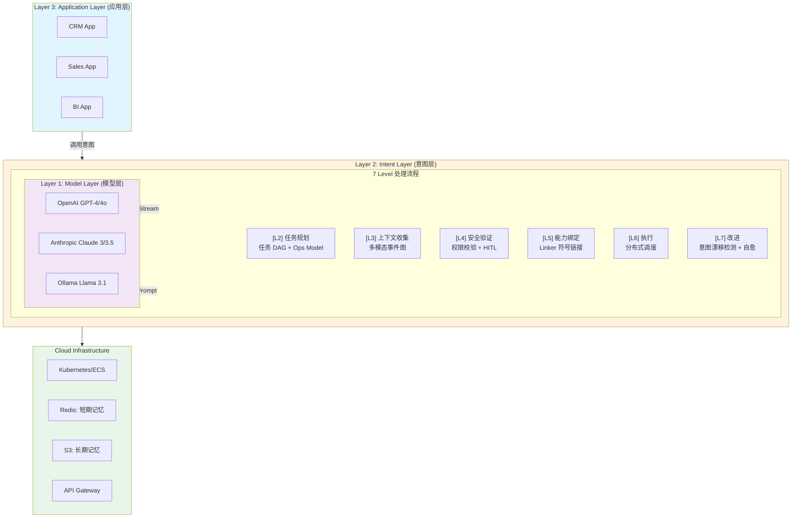

---

## 图 2：PEF 编译与执行流程

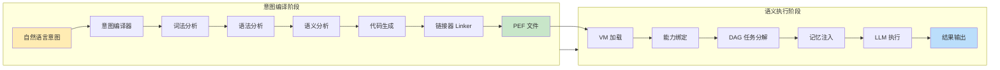

---

## 图 3：PEF 文件格式结构

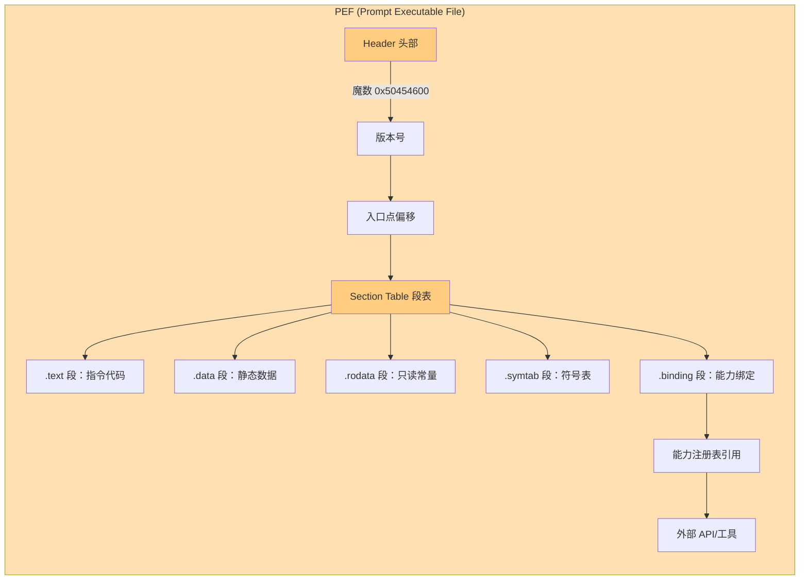

---

## 图 4：分布式自举执行流程

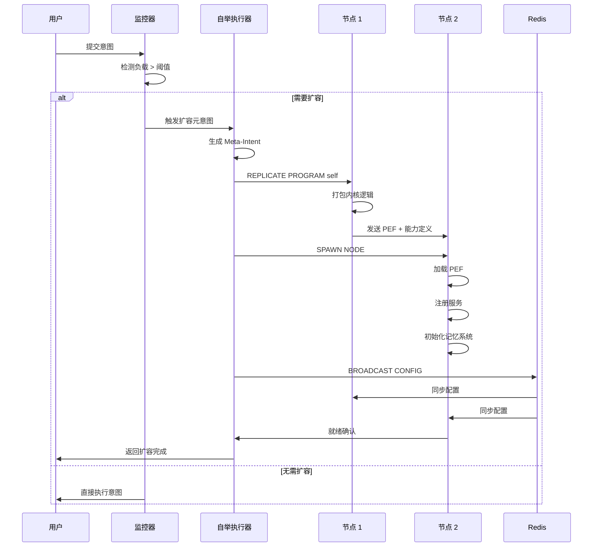

---

## 图 5：协议自扩展器工作流程

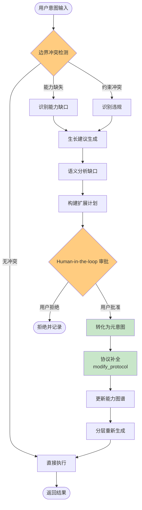

---

## 图 6：元意图层级结构

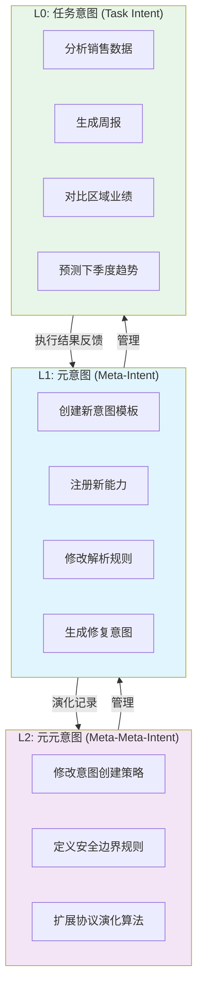

---

## 图 7：意图漂移检测与自愈

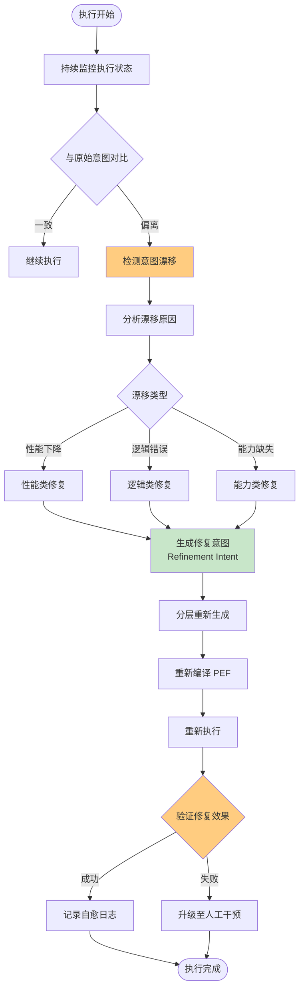

---

## 图 8：Map/Reduce 分布式语义执行

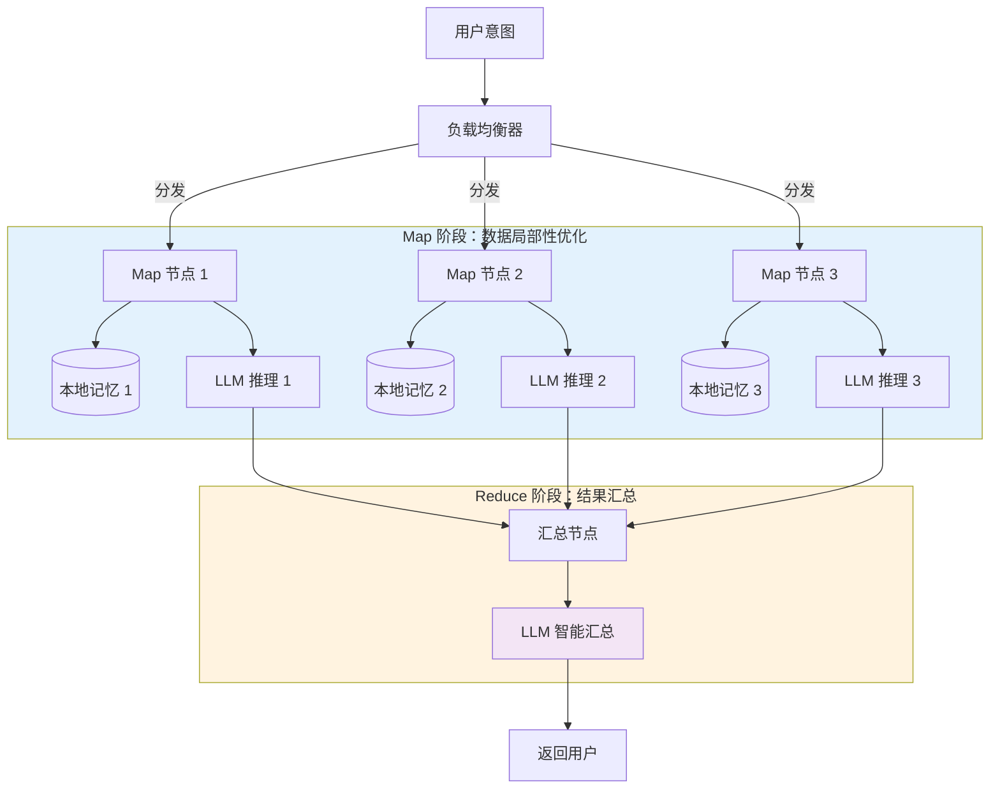

---

## 图 9：语义 CPU 执行模型

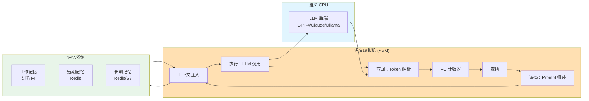

---

## 图 10：能力注册与链接机制

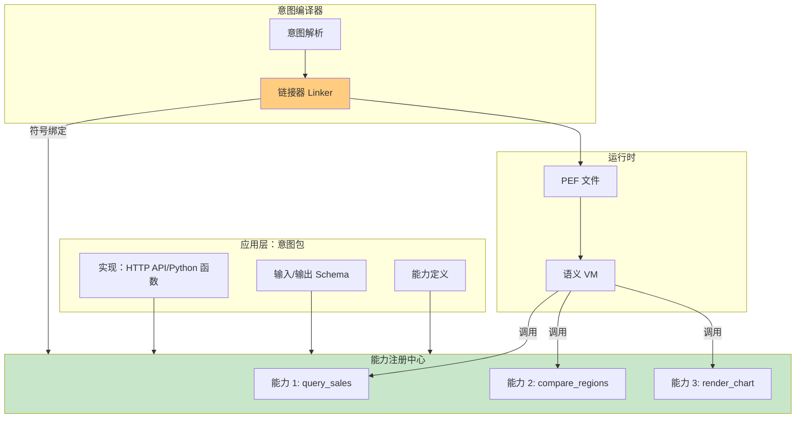

---

## 图 11：分布式记忆同步架构

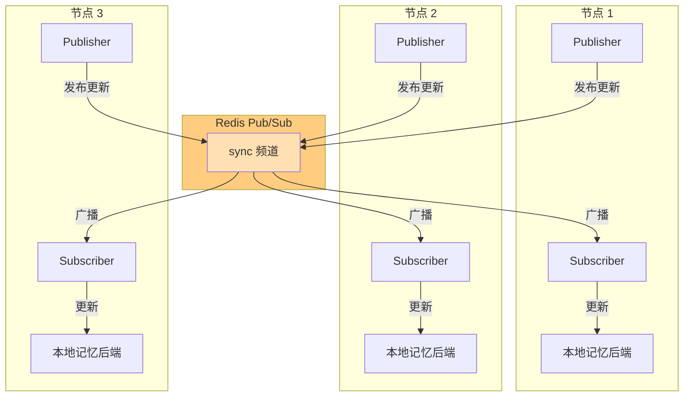

---

## 图 12：Self-Bootstrap 层级实现

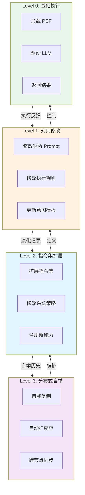

---

## 图 13：软件范式演进对比

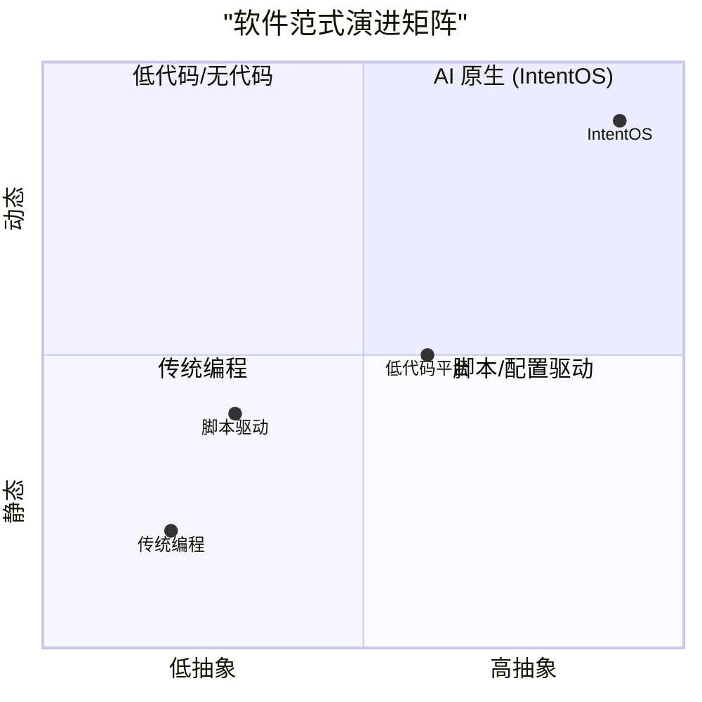

---

## 图 14：意图执行生命周期

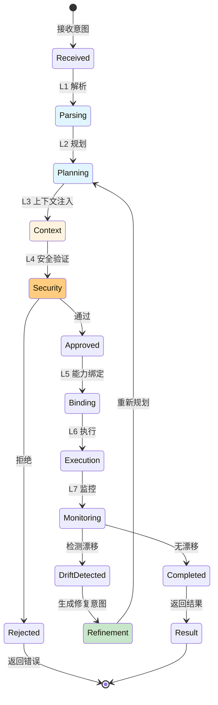

---

## 图 15：IntentOS 与 Harness 对比

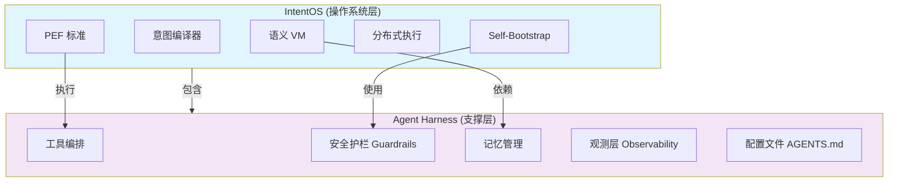

---

## 图 16：图灵完备性与停机机制平衡

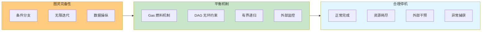
