# IntentOS 架构图集 (v9.5.0)

## 图 1：套娃分层架构总览

  

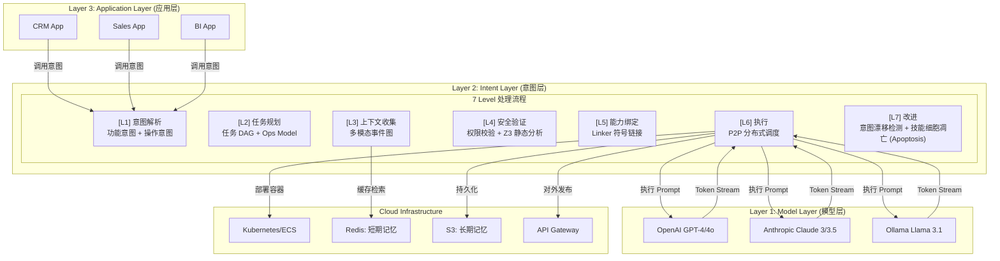
```mermaid
flowchart TB
    subgraph Layer3["Layer 3: Application Layer (应用层)"]
        A1["CRM App"]
        A2["Sales App"]
        A3["BI App"]
    end
    
    subgraph Layer2["Layer 2: Intent Layer (意图层)"]
        subgraph L7["7 Level 处理流程"]
            direction TB
            L1["[L1] 意图解析<br/>功能意图 + 操作意图"]
            L2_["[L2] 任务规划<br/>任务 DAG + Ops Model"]
            L3_["[L3] 上下文收集<br/>多模态事件图"]
            L4["[L4] 安全验证<br/>权限校验 + Z3 静态分析"]
            L5["[L5] 能力绑定<br/>Linker 符号链接"]
            L6["[L6] 执行<br/>P2P 分布式调度"]
            L7_["[L7] 改进<br/>意图漂移检测 + 技能细胞凋亡 (Apoptosis)"]
        end
    end
    
    subgraph Layer1["Layer 1: Model Layer (模型层)"]
        M1["OpenAI GPT-4/4o"]
        M2["Anthropic Claude 3/3.5"]
        M3["Ollama Llama 3.1"]
    end
    
    subgraph Infra["Cloud Infrastructure"]
        K8s["Kubernetes/ECS"]
        Redis["Redis: 短期记忆"]
        S3["S3: 长期记忆"]
        APIGW["API Gateway"]
    end
    
    A1 -->|调用意图| L1
    A2 -->|调用意图| L1
    A3 -->|调用意图| L1
    
    L6 -->|执行 Prompt| M1
    L6 -->|执行 Prompt| M2
    L6 -->|执行 Prompt| M3
    
    M1 -->|Token Stream| L6
    M2 -->|Token Stream| L6
    M3 -->|Token Stream| L6
    
    L3_ -->|缓存检索| Redis
    L6 -->|持久化| S3
    L6 -->|部署容器| K8s
    L6 -->|对外发布| APIGW
```

---

## 图 2：PEF 编译与执行流程

  

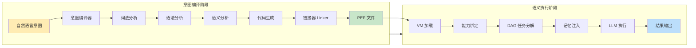
```mermaid
flowchart LR
    subgraph Compilation["意图编译阶段"]
        NL["自然语言意图"] --> IC["意图编译器"]
        IC --> LA["词法分析"]
        LA --> PA["语法分析"]
        PA --> SA["语义分析"]
        SA --> CG["代码生成"]
        CG --> LN["链接器 Linker"]
        LN --> PEF["PEF 文件"]
    end
    
    subgraph Execution["语义执行阶段"]
        PEF --> LOAD["VM 加载"]
        LOAD --> BIND["能力绑定"]
        BIND --> DAG["DAG 任务分解"]
        DAG --> MEM["记忆注入"]
        MEM --> LLM["LLM 执行"]
        LLM --> RESULT["结果输出"]
    end
    
    Compilation --> Execution
    
    style NL fill:#ffecb3
    style PEF fill:#c8e6c9
    style RESULT fill:#bbdefb
```

---

## 图 3：PEF 文件格式结构

  

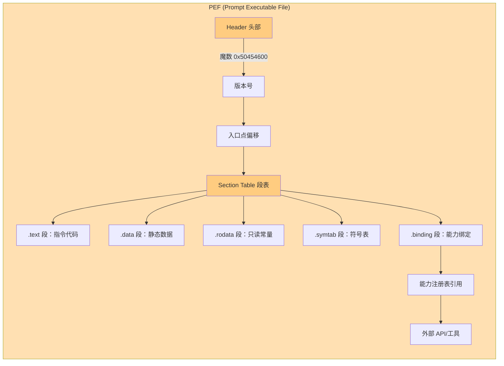
```mermaid
flowchart TB
    subgraph PEF["PEF (Prompt Executable File)"]
        direction TB
        H["Header 头部"]
        H --> |"魔数 0x50454600"| V["版本号"]
        V --> E["入口点偏移"]
        
        E --> ST["Section Table 段表"]
        ST --> T1[".text 段：指令代码"]
        ST --> T2[".data 段：静态数据"]
        ST --> T3[".rodata 段：只读常量"]
        ST --> T4[".symtab 段：符号表"]
        ST --> T5[".binding 段：能力绑定"]
        
        T5 --> CAP["能力注册表引用"]
        CAP --> API["外部 API/工具"]
    end

    style PEF fill:#ffe0b2
    style H fill:#ffcc80
    style ST fill:#ffcc80
```

---

## 图 4：分布式自举执行流程

  

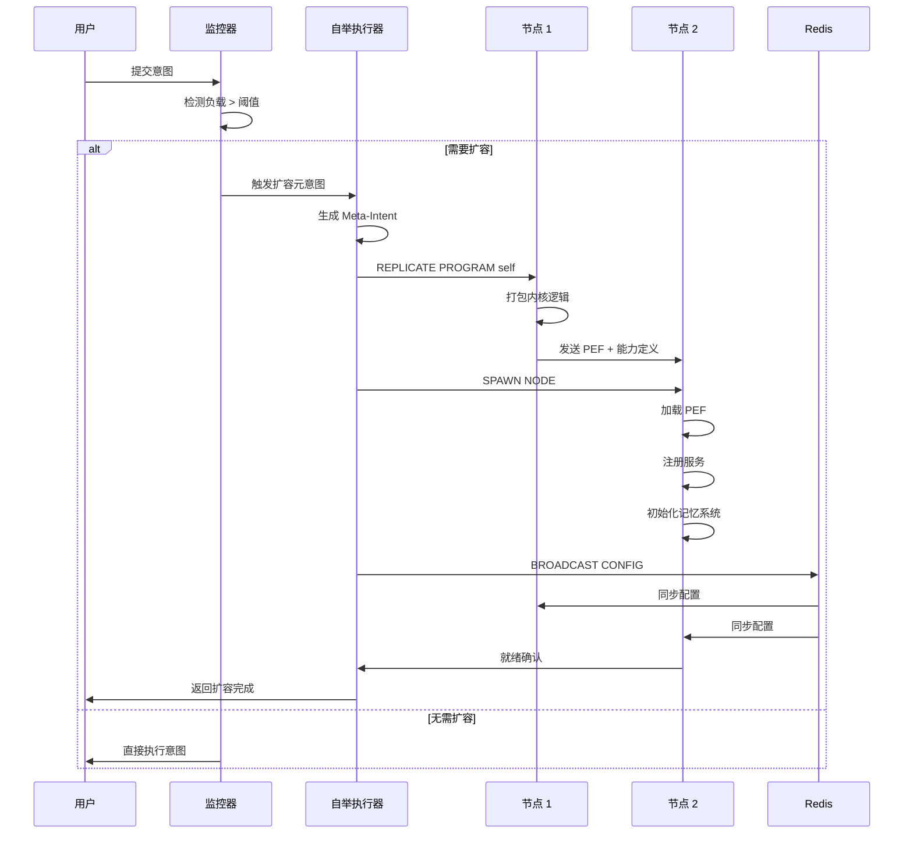
```mermaid
sequenceDiagram
    participant User as 用户
    participant Monitor as 监控器
    participant Executor as 自举执行器
    participant Node1 as 节点 1
    participant Node2 as 节点 2
    participant Redis as Redis

    User->>Monitor: 提交意图
    Monitor->>Monitor: 检测负载 > 阈值

    alt 需要扩容
        Monitor->>Executor: 触发扩容元意图
        Executor->>Executor: 生成 Meta-Intent

        Executor->>Node1: REPLICATE PROGRAM self
        Node1->>Node1: 打包内核逻辑
        Node1->>Node2: 发送 PEF + 能力定义

        Executor->>Node2: SPAWN NODE
        Node2->>Node2: 加载 PEF
        Node2->>Node2: 注册服务
        Node2->>Node2: 初始化记忆系统

        Executor->>Redis: BROADCAST CONFIG
        Redis->>Node1: 同步配置
        Redis->>Node2: 同步配置

        Node2->>Executor: 就绪确认
        Executor->>User: 返回扩容完成
    else 无需扩容
        Monitor->>User: 直接执行意图
    end
```

---

## 图 5：协议自扩展器工作流程

  

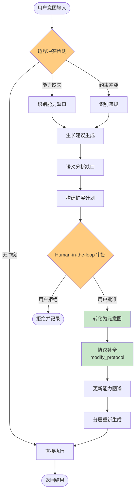
```mermaid
flowchart TD
    Start(["用户意图输入"]) --> Detect{"边界冲突检测"}
    
    Detect -->|"能力缺失"| Gap["识别能力缺口"]
    Detect -->|"约束冲突"| Violation["识别违规"]
    Detect -->|"无冲突"| Execute["直接执行"]
    
    Gap --> Suggest["生长建议生成"]
    Violation --> Suggest
    
    Suggest --> Analyze["语义分析缺口"]
    Analyze --> Plan["构建扩展计划"]
    
    Plan --> Approve{"Human-in-the-loop 审批"}
    Approve -->|"用户批准"| MetaIntent["转化为元意图"]
    Approve -->|"用户拒绝"| Reject(["拒绝并记录"])
    
    MetaIntent --> Patch["协议补全<br/>modify_protocol"]
    Patch --> Update["更新能力图谱"]
    Update --> Recompile["分层重新生成"]
    Recompile --> Execute
    
    Execute --> Result(["返回结果"])

    style Detect fill:#ffcc80
    style Approve fill:#ffcc80
    style MetaIntent fill:#c8e6c9
    style Patch fill:#c8e6c9
```

---

## 图 6：元意图层级结构

  

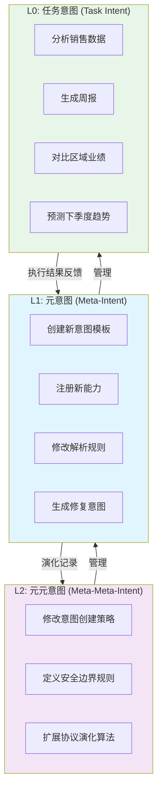
```mermaid
flowchart TB
    subgraph L2["L2: 元元意图 (Meta-Meta-Intent)"]
        MM1["修改意图创建策略"]
        MM2["定义安全边界规则"]
        MM3["扩展协议演化算法"]
    end
    
    subgraph L1["L1: 元意图 (Meta-Intent)"]
        M1["创建新意图模板"]
        M2["注册新能力"]
        M3["修改解析规则"]
        M4["生成修复意图"]
    end
    
    subgraph L0["L0: 任务意图 (Task Intent)"]
        T1["分析销售数据"]
        T2["生成周报"]
        T3["对比区域业绩"]
        T4["预测下季度趋势"]
    end
    
    L2 -->|管理| L1
    L1 -->|管理| L0
    L0 -->|执行结果反馈| L1
    L1 -->|演化记录| L2

    style L2 fill:#f3e5f5
    style L1 fill:#e1f5fe
    style L0 fill:#e8f5e9
```

---

## 图 7：意图漂移检测与自愈

  

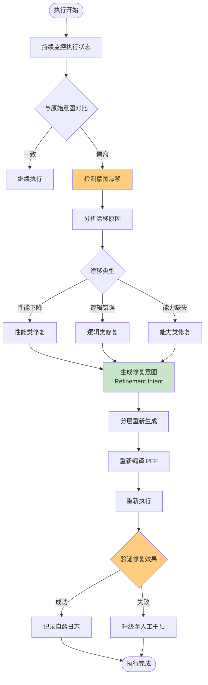
```mermaid
flowchart TD
    Start(["执行开始"]) --> Monitor["持续监控执行状态"]
    
    Monitor --> Compare{"与原始意图对比"}
    Compare -->|"一致"| Continue["继续执行"]
    Compare -->|"偏离"| Detect["检测意图漂移"]
    
    Detect --> Analyze["分析漂移原因"]
    Analyze --> Type{"漂移类型"}
    
    Type -->|"性能下降"| Perf["性能类修复"]
    Type -->|"逻辑错误"| Logic["逻辑类修复"]
    Type -->|"能力缺失"| Cap["能力类修复"]
    
    Perf --> GenIntent["生成修复意图<br/>Refinement Intent"]
    Logic --> GenIntent
    Cap --> GenIntent
    
    GenIntent --> Regenerate["分层重新生成"]
    Regenerate --> Recompile["重新编译 PEF"]
    Recompile --> ReExecute["重新执行"]
    
    ReExecute --> Verify{"验证修复效果"}
    Verify -->|"成功"| Log["记录自愈日志"]
    Verify -->|"失败"| Escalate["升级至人工干预"]
    
    Log --> End(["执行完成"])
    Escalate --> End

    style Detect fill:#ffcc80
    style GenIntent fill:#c8e6c9
    style Verify fill:#ffcc80
```

---

## 图 8：Map/Reduce 分布式语义执行

  

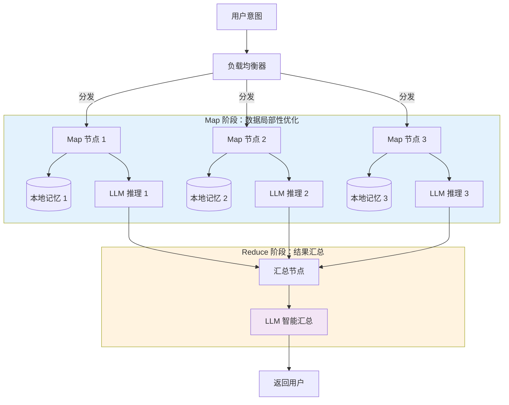
```mermaid
flowchart TB
    User["用户意图"] --> LB["负载均衡器"]

    LB -->|"分发"| Map1["Map 节点 1"]
    LB -->|"分发"| Map2["Map 节点 2"]
    LB -->|"分发"| Map3["Map 节点 3"]

    subgraph Map["Map 阶段：数据局部性优化"]
        Map1 --> Mem1[("本地记忆 1")]
        Map2 --> Mem2[("本地记忆 2")]
        Map3 --> Mem3[("本地记忆 3")]

        Map1 --> LLM1["LLM 推理 1"]
        Map2 --> LLM2["LLM 推理 2"]
        Map3 --> LLM3["LLM 推理 3"]
    end

    LLM1 --> ReduceNode["汇总节点"]
    LLM2 --> ReduceNode
    LLM3 --> ReduceNode

    subgraph Reduce["Reduce 阶段：结果汇总"]
        ReduceNode --> LLM_Sum["LLM 智能汇总"]
    end

    LLM_Sum --> Result["返回用户"]

    style Map fill:#e3f2fd
    style Reduce fill:#fff3e0
    style LLM_Sum fill:#f3e5f5
```

---

## 图 9：语义 CPU 执行模型 (隐式 UNIX 管道)

  

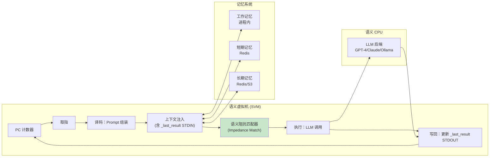
```mermaid
flowchart LR
    subgraph SVM["语义虚拟机 (SVM)"]
        direction TB
        PC["PC 计数器"] --> Fetch["取指"]
        Fetch --> Decode["译码：Prompt 组装"]
        Decode --> Inject["上下文注入 <br/>(含 _last_result STDIN)"]
        Inject --> Matcher["语义阻抗匹配器 <br/>(Impedance Match)"]
        Matcher --> Execute["执行：LLM 调用"]
        Execute --> Writeback["写回：更新 _last_result STDOUT"]
        Writeback --> PC
    end
    
    subgraph Memory["记忆系统"]
        WM["工作记忆<br/>进程内"]
        SM["短期记忆<br/>Redis"]
        LM["长期记忆<br/>Redis/S3"]
    end
    
    subgraph LLM["语义 CPU"]
        Model["LLM 后端<br/>GPT-4/Claude/Ollama"]
    end
    
    Inject <--> WM
    Inject <--> SM
    Inject <--> LM
    
    Execute --> Model
    Model --> Writeback

    style Matcher fill:#c8e6c9
```

---

## 图 10：能力注册与链接机制

  

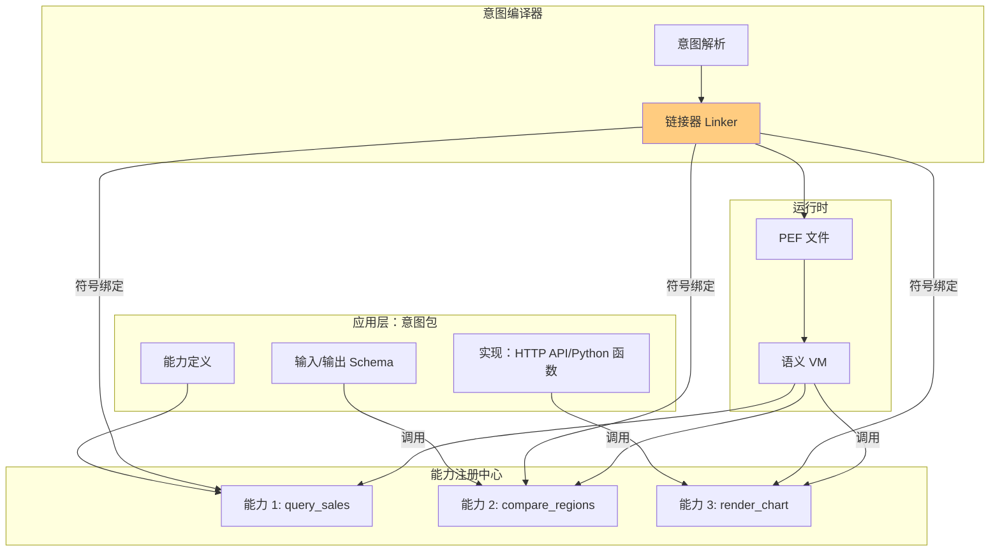
```mermaid
flowchart TB
    subgraph App["应用层：意图包"]
        Def["能力定义"]
        Schema["输入/输出 Schema"]
        Impl["实现：HTTP API/Python 函数"]
    end

    subgraph Registry["能力注册中心"]
        Cap1["能力 1: query_sales"]
        Cap2["能力 2: compare_regions"]
        Cap3["能力 3: render_chart"]
    end

    subgraph Compiler["意图编译器"]
        Parse["意图解析"]
        Linker["链接器 Linker"]
    end

    subgraph Runtime["运行时"]
        PEF["PEF 文件"]
        VM["语义 VM"]
    end

    Def --> Cap1
    Schema --> Cap2
    Impl --> Cap3

    Parse --> Linker
    Linker -->|"符号绑定"| Cap1
    Linker -->|"符号绑定"| Cap2
    Linker -->|"符号绑定"| Cap3
    Linker --> PEF
    PEF --> VM
    VM -->|"调用"| Cap1
    VM -->|"调用"| Cap2
    VM -->|"调用"| Cap3

    style Linker fill:#ffcc80
```

---

## 图 11：去中心化 P2P 语义节点网络

  

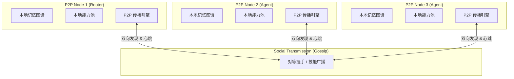
```mermaid
flowchart TB
    subgraph Node1["P2P Node 1 (Router)"]
        Mem1["本地记忆图谱"]
        Skill1["本地能力池"]
        Engine1["P2P 传播引擎"]
    end
    
    subgraph Node2["P2P Node 2 (Agent)"]
        Mem2["本地记忆图谱"]
        Skill2["本地能力池"]
        Engine2["P2P 传播引擎"]
    end
    
    subgraph Node3["P2P Node 3 (Agent)"]
        Mem3["本地记忆图谱"]
        Skill3["本地能力池"]
        Engine3["P2P 传播引擎"]
    end
    
    subgraph Protocol["Social Transmission (Gossip)"]
        Channel["对等握手 / 技能广播"]
    end
    
    Engine1 <-->|"双向发现 & 心跳"| Channel
    Engine2 <-->|"双向发现 & 心跳"| Channel
    Engine3 <-->|"双向发现 & 心跳"| Channel
```

---

## 图 12：Self-Bootstrap 演进循环 (Loop 1 - 5)

  

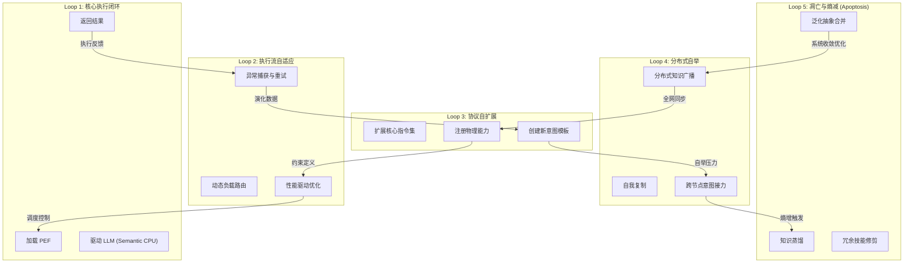
```mermaid
flowchart TB
    subgraph Loop5["Loop 5: 凋亡与熵减 (Apoptosis)"]
        A1["知识蒸馏"]
        A2["冗余技能修剪"]
        A3["泛化抽象合并"]
    end

    subgraph Level3["Loop 4: 分布式自举"]
        D1["自我复制"]
        D2["跨节点意图接力"]
        D3["分布式知识广播"]
    end

    subgraph Level2["Loop 3: 协议自扩展"]
        I1["扩展核心指令集"]
        I2["创建新意图模板"]
        I3["注册物理能力"]
    end

    subgraph Level1["Loop 2: 执行流自适应"]
        R1["动态负载路由"]
        R2["异常捕获与重试"]
        R3["性能驱动优化"]
    end

    subgraph Level0["Loop 1: 核心执行闭环"]
        E1["加载 PEF"]
        E2["驱动 LLM (Semantic CPU)"]
        E3["返回结果"]
    end

    A3 -->|"系统收敛优化"| D3
    D3 -->|"全网同步"| I3
    I3 -->|"约束定义"| R3
    R3 -->|"调度控制"| E1
    E3 -->|"执行反馈"| R2
    R2 -->|"演化数据"| I2
    I2 -->|"自举压力"| D2
    D2 -->|"熵增触发"| A1
```

---

## 图 13：软件范式演进对比

  

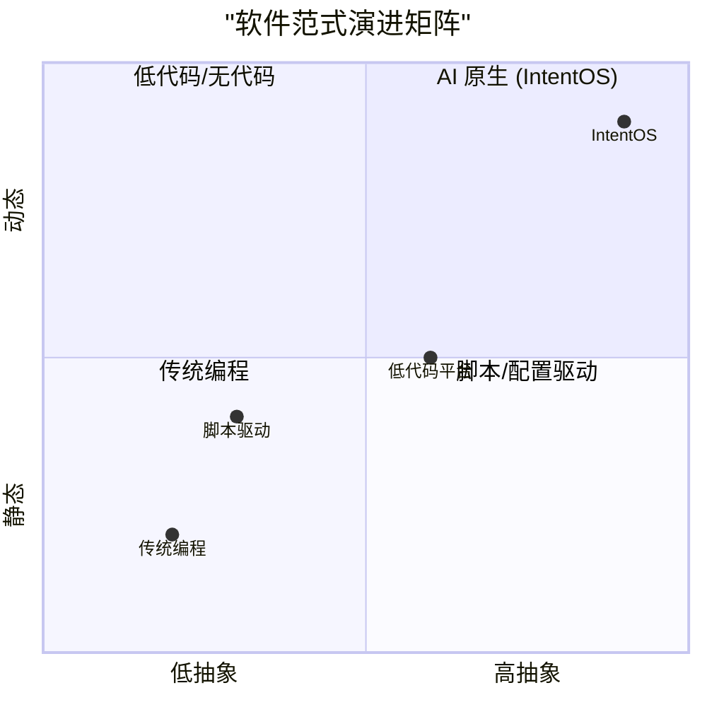
```mermaid
quadrantChart
    title "软件范式演进矩阵"
    x-axis "低抽象" --> "高抽象"
    y-axis "静态" --> "动态"
    quadrant-1 "AI 原生 (IntentOS)"
    quadrant-2 "低代码/无代码"
    quadrant-3 "传统编程"
    quadrant-4 "脚本/配置驱动"
    
    "传统编程": [0.2, 0.2]
    "脚本驱动": [0.3, 0.4]
    "低代码平台": [0.6, 0.5]
    "IntentOS": [0.9, 0.9]
```

---

## 图 14：意图执行生命周期

  

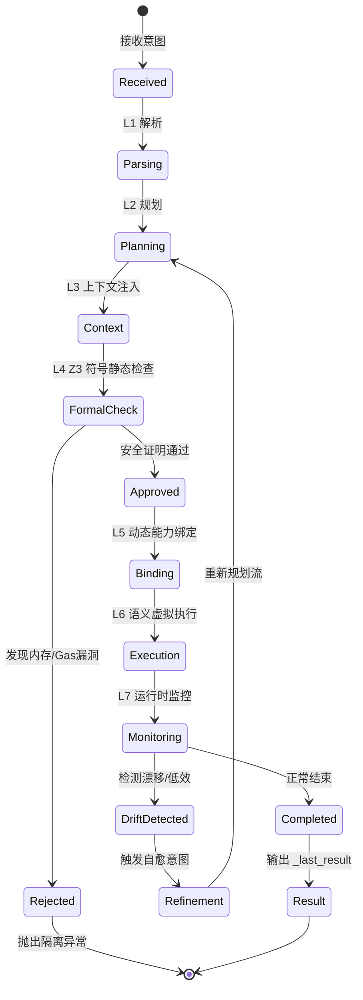
```mermaid
stateDiagram-v2
    [*] --> Received: 接收意图
    
    Received --> Parsing: L1 解析
    Parsing --> Planning: L2 规划
    Planning --> Context: L3 上下文注入
    Context --> FormalCheck: L4 Z3 符号静态检查
    
    FormalCheck --> Approved: 安全证明通过
    FormalCheck --> Rejected: 发现内存/Gas漏洞
    Rejected --> [*]: 抛出隔离异常
    
    Approved --> Binding: L5 动态能力绑定
    Binding --> Execution: L6 语义虚拟执行
    Execution --> Monitoring: L7 运行时监控
    
    Monitoring --> DriftDetected: 检测漂移/低效
    Monitoring --> Completed: 正常结束
    
    DriftDetected --> Refinement: 触发自愈意图
    Refinement --> Planning: 重新规划流
    
    Completed --> Result: 输出 _last_result
    Result --> [*]
```

---

## 图 15：IntentOS 与 Harness 对比

  

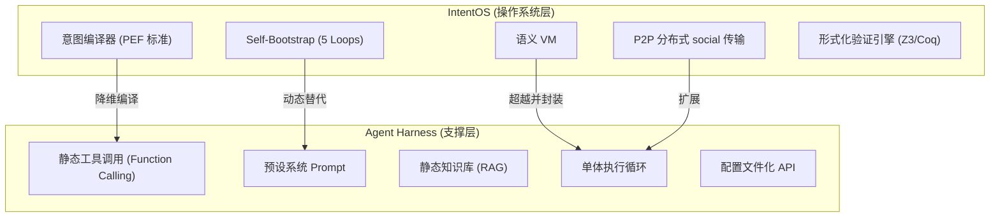
```mermaid
flowchart TB
    subgraph IntentOS["IntentOS (操作系统层)"]
        IO1["语义 VM"]
        IO2["意图编译器 (PEF 标准)"]
        IO3["Self-Bootstrap (5 Loops)"]
        IO4["P2P 分布式 social 传输"]
        IO5["形式化验证引擎 (Z3/Coq)"]
    end
    
    subgraph Harness["Agent Harness (支撑层)"]
        H1["静态工具调用 (Function Calling)"]
        H2["预设系统 Prompt"]
        H3["静态知识库 (RAG)"]
        H4["单体执行循环"]
        H5["配置文件化 API"]
    end
    
    IO1 -->|"超越并封装"| H4
    IO2 -->|"降维编译"| H1
    IO3 -->|"动态替代"| H2
    IO4 -->|"扩展"| H4
```

---

## 图 16：图灵完备性与双层安全停机机制 (Formal Verification)

  

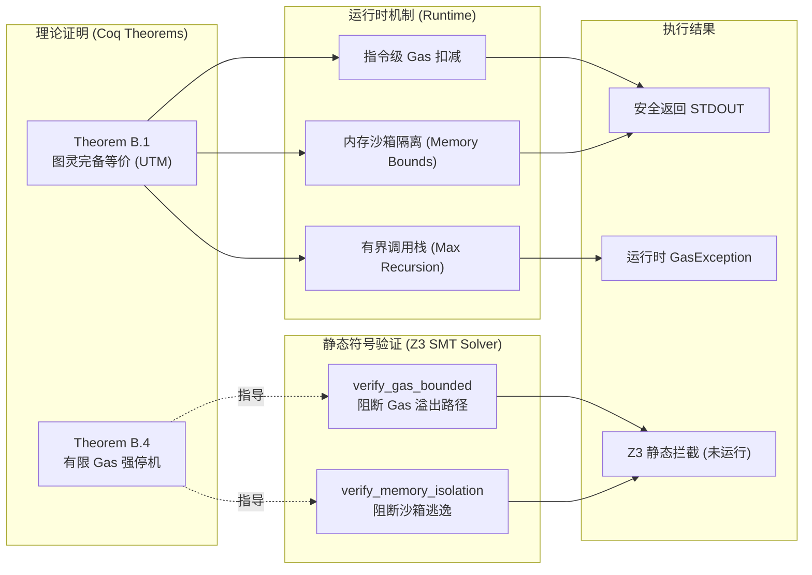
```mermaid
flowchart LR
    subgraph Theoretical["理论证明 (Coq Theorems)"]
        T1["Theorem B.1<br/>图灵完备等价 (UTM)"]
        T2["Theorem B.4<br/>有限 Gas 强停机"]
    end

    subgraph Dynamic["运行时机制 (Runtime)"]
        B1["指令级 Gas 扣减"]
        B2["内存沙箱隔离 (Memory Bounds)"]
        B3["有界调用栈 (Max Recursion)"]
    end

    subgraph Static["静态符号验证 (Z3 SMT Solver)"]
        S1["verify_gas_bounded<br/>阻断 Gas 溢出路径"]
        S2["verify_memory_isolation<br/>阻断沙箱逃逸"]
    end

    subgraph Halt["执行结果"]
        H1["安全返回 STDOUT"]
        H2["Z3 静态拦截 (未运行)"]
        H3["运行时 GasException"]
    end

    T1 --> B1
    T1 --> B2
    T1 --> B3
    T2 -.->|"指导"| S1
    T2 -.->|"指导"| S2
    B1 --> H1
    B2 --> H1
    B3 --> H3
    S1 --> H2
    S2 --> H2
```